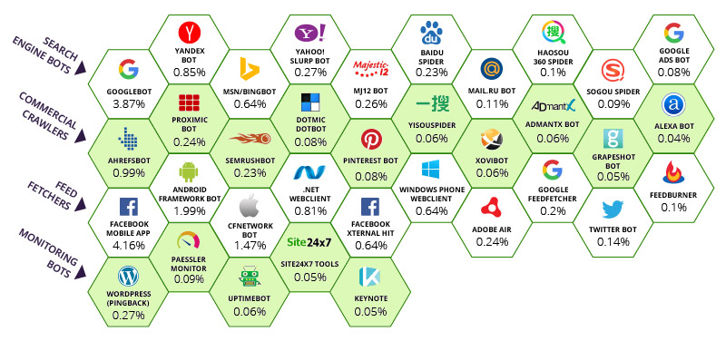
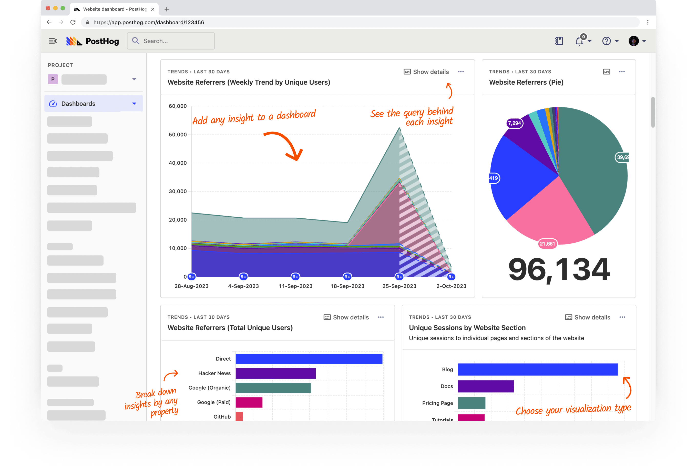

# Remove Bots from PostHog Tracking

This JavaScript snippet helps prevent bot traffic from polluting your [PostHog](https://posthog.com) analytics.  

It detects common web crawlers, scrapers, and bots based on the browser’s `User-Agent` string and automatically opts them out of tracking using the PostHog API's `opt_out_capturing()` method.

**You are most welcome to use this code in your commercial projects, all that I ask in return is that you credit my work by providing a link back to this repository. Thank you & Enjoy!**

---
Bots are non-human website visitors, also known as "crawlers", which gather information for third-party services.


Posthog is a product analytics tool:


## How It Works

- The script waits until the global `posthog` object is available.
- It checks the browser’s `navigator.userAgent`.
- If the `User-Agent` matches a large list of known bots and crawlers:
  - A PostHog event (`labelling user as a bot`) is captured with a flag (`is_bot: true`).
  - The bot is then opted out of all further tracking (`posthog.opt_out_capturing()`).
- If the visitor is a normal user, tracking continues as usual.


## Usage

1. Copy the `remove_bots_posthog.js` file into your project.
2. Include it **after** loading PostHog in your frontend bundle or HTML page:
    ```html
    <script src="https://your-cdn/remove_bots_posthog.js"></script>
    ```

    or if bundling:
    ```
    import './remove_bots_posthog.js';
    ```


